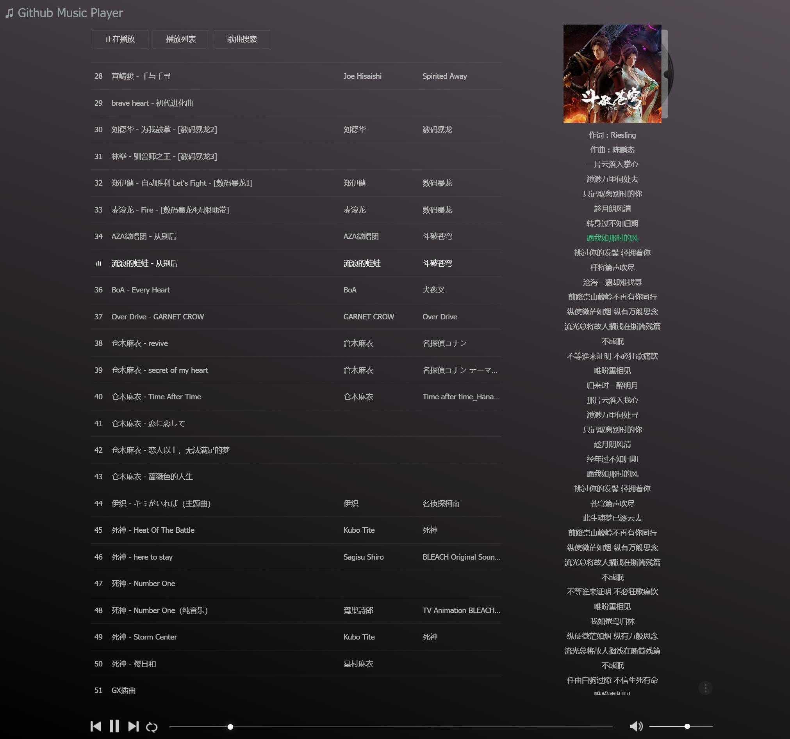
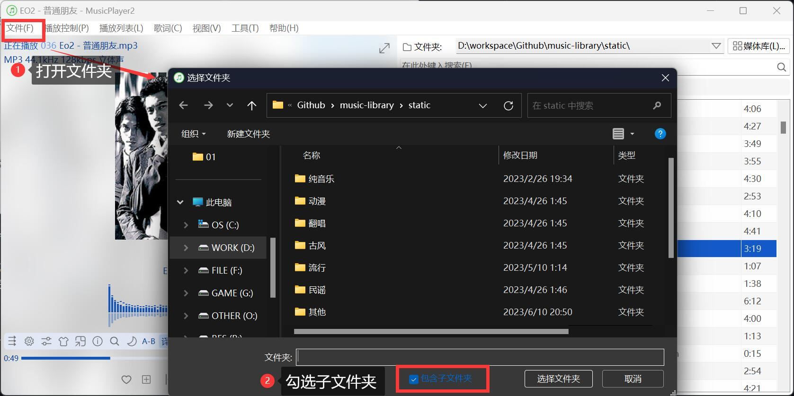
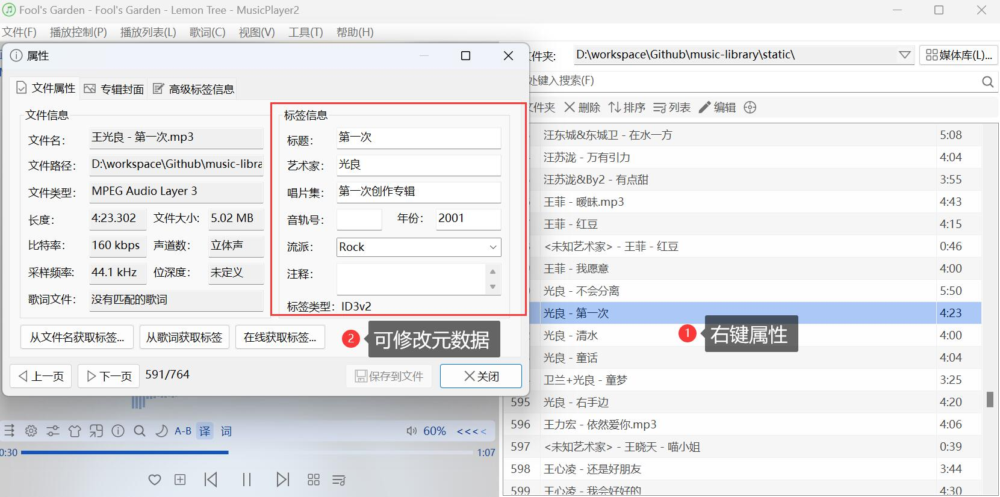
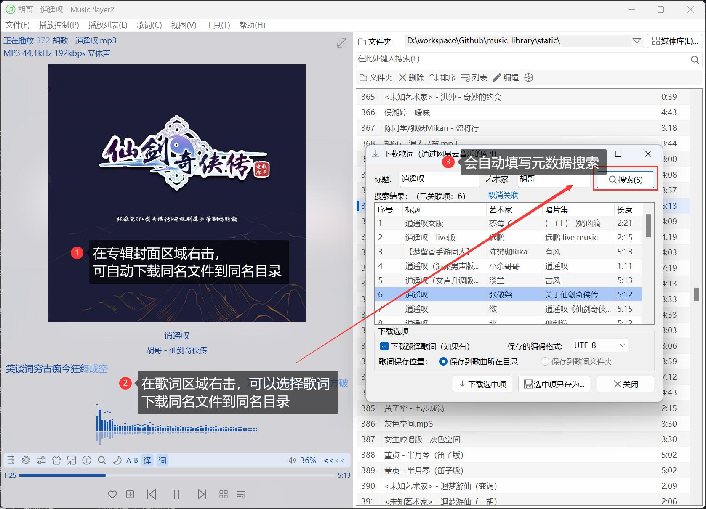

# Github Pages Music Player

> Github Pages 在线音乐播放器（直接读取仓库 mp3 文件，无需部署后台）

------

## 0x00 前言

个人用的音乐库 + 跨平台播放支持。

## 0x10 前置准备

1. 把音乐文件（暂时只支持 `*.mp3`）放到 [`static`](./static/) 下的任意子目录
2. 执行 `python -m pip install -r ./py/requirements.txt` 安装必要依赖
3. 执行 `python ./py/fix_metadata.py` 自动修复音乐文件的元数据
4. 执行 `python ./py/gen_music_list.py` 生成歌单 [`music_list.json`](./static/music_list.json)
5. 执行 `python ./py/gen_login.py` 生成网页播放器的登录账密

## 0x20 Github Pages 在线播放器

1. 启动 Github Pages 即可
2. 当上传新的音乐文件到 [`static`](./static/) 下，[update_music_list.yml](./.github/workflows/update_music_list.yml) 会自动刷新歌单，触发 Github Pages 刷新
3. 访问 Github Pages 分配的域名，填入登录账密即可（默认帐密为 `admin / 123456`）

> 此方式支持 PC 端和移动端

## 0x30 Docker 本地播放器

1. 本地安装 docker 和 docker-compose
2. 执行 [`bin/build.sh|ps1`](./bin/build.sh) 构建镜像
3. 执行 [`bin/run.sh|ps1`](./bin/run.sh) 运行容器环境
4. 访问 http://127.0.0.1:7080 ，填入登录账密即可

> 此方式是在本地模拟 Github Pages，一般用于调试代码

## 0x40 MusicPlayer2 播放器

1. 安装 [MusicPlayer2](https://github.com/zhongyang219/MusicPlayer2/wiki) 
2. 使用此软件加载 [`static`](./static/) 目录下的音乐文件

之所以推荐这款软件，是因为可以很方便修改音乐文件的元数据、下载歌词和专辑封面图片，然后直接提供给 Github Pages 或 Docker 播放器使用

> 更新元数据、歌词 或 封面图片后，需要重新生成歌单 [`music_list.json`](./static/music_list.json)

## 0x50 mStream 播放器

1. 本地安装 docker 和 docker-compose
2. 参考 [mstream-docker](https://github.com/lyy289065406/mstream-docker) 的指引部署
3. 访问 http://127.0.0.1:9000 ，填入登录账密
4. 在页面的 File Explore 加载 [`static`](./static/) 目录下的音乐文件

> 只能在本地 PC 使用，除了支持自定义歌单之外，没什么优势，而且不支持歌词。Github Pages 播放器未来也会支持自定义歌单（存储在 cookies）

